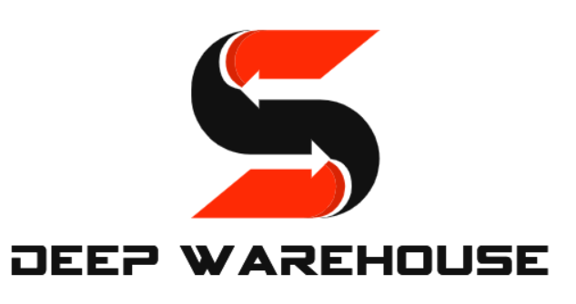

# Deep Warehouse


Deep Warehouse is a free-to-use software implementation of warehouse structures. The aim of this project is to provide a highly efficient simulation for creating learning agents towards mastering warehouse logistics with autonomous agents.

# Installation
Currently, the project must be cloned (`git clone git@github.com:cair/deep-warehouse.git`)

# Usage
```python
from deep_logistics import DeepLogistics
from deep_logistics import SpawnStrategies
from deep_logistics.agent import Agent, ManhattanAgent


if __name__ == "__main__":

    env = DeepLogistics(width=30,
                        height=30,
                        depth=3,
                        taxi_n=1,
                        ups=5000,
                        graphics_render=True,
                        delivery_locations=[
                            (5, 5),
                            (15, 15),
                            (20, 20),
                            (10, 10),
                            (5, 10)
                        ],
                        spawn_strategy=SpawnStrategies.RandomSpawnStrategy
                        )

    """Parameters"""
    EPISODES = 1000
    EPISODE_MAX_STEPS = 100

    """Add agents"""
    env.agents.add_agent(ManhattanAgent, n=20)

    for episode in range(EPISODES):
        env.reset()

        terminal = False
        steps = 0

        while terminal is False:
            env.update()
            env.render()

            terminal = env.is_terminal()
            steps += 1

            if terminal:
                print("Episode %s, Steps: %s" % (episode, steps))
                break

        """Add a new agent. (Harder) """
        #env.agents.add_agent(ManhattanAgent)
```

# How to cite this work
```bibtex
@InProceedings{10.1007/978-3-030-34885-4_3,
  author="Andersen, Per-Arne
  and Goodwin, Morten
  and Granmo, Ole-Christoffer",
  editor="Bramer, Max
  and Petridis, Miltos",
  title="Towards Model-Based Reinforcement Learning for Industry-Near Environments",
  booktitle="Artificial Intelligence XXXVI",
  year="2019",
  publisher="Springer International Publishing",
  address="Cham",
  pages="36--49",
  abstract="Deep reinforcement learning has over the past few years shown great potential in learning near-optimal control in complex simulated environments with little visible information. Rainbow (Q-Learning) and PPO (Policy Optimisation) have shown outstanding performance in a variety of tasks, including Atari 2600, MuJoCo, and Roboschool test suite. Although these algorithms are fundamentally different, both suffer from high variance, low sample efficiency, and hyperparameter sensitivity that, in practice, make these algorithms a no-go for critical operations in the industry.",
  isbn="978-3-030-34885-4"
}
``` 

# Licence
Copyright 2022 Per-Arne Andersen

Permission is hereby granted, free of charge, to any person obtaining a copy of this software and associated documentation files (the "Software"), to deal in the Software without restriction, including without limitation the rights to use, copy, modify, merge, publish, distribute, sublicense, and/or sell copies of the Software, and to permit persons to whom the Software is furnished to do so, subject to the following conditions:

The above copyright notice and this permission notice shall be included in all copies or substantial portions of the Software.

THE SOFTWARE IS PROVIDED "AS IS", WITHOUT WARRANTY OF ANY KIND, EXPRESS OR IMPLIED, INCLUDING BUT NOT LIMITED TO THE WARRANTIES OF MERCHANTABILITY, FITNESS FOR A PARTICULAR PURPOSE AND NONINFRINGEMENT. IN NO EVENT SHALL THE AUTHORS OR COPYRIGHT HOLDERS BE LIABLE FOR ANY CLAIM, DAMAGES OR OTHER LIABILITY, WHETHER IN AN ACTION OF CONTRACT, TORT OR OTHERWISE, ARISING FROM, OUT OF OR IN CONNECTION WITH THE SOFTWARE OR THE USE OR OTHER DEALINGS IN THE SOFTWARE.
